# Sistem Pelaporan Fasilitas Kampus

Aplikasi berbasis web untuk mengelola laporan kerusakan fasilitas kampus menggunakan **CodeIgniter 4**.

## 📋 Deskripsi Sistem

Sistem ini memungkinkan mahasiswa untuk melaporkan kerusakan fasilitas kampus, dan admin dapat memverifikasi serta mengelola laporan tersebut. Sistem dilengkapi dengan notifikasi real-time, manajemen akun multi-role, dan dashboard statistik.

## 🎯 Fitur Utama

### Untuk Mahasiswa (User)

- ✅ Registrasi dan login dengan email verification
- 📝 Membuat laporan kerusakan fasilitas
- 📊 Melihat status laporan pribadi
- ✏️ Edit/hapus laporan (hanya status pending/ditolak)
- 🔔 Notifikasi update status laporan
- 👤 Manajemen profil

### Untuk Admin

- 📋 Dashboard dengan statistik KPI
- ✅ Verifikasi laporan (pending → diproses → selesai/ditolak)
- 🏢 Manajemen gedung dan ruangan
- 👥 Manajemen akun user (untuk superadmin)
- 📊 Laporan dan riwayat lengkap
- 🔔 Notifikasi laporan baru

### Untuk Rektor

- 📈 Dashboard statistik dan KPI
- 📊 Laporan analitik
- 🔍 Audit log aktivitas

## 🗄️ Database Schema

### Tabel Utama

#### `users`

- Menyimpan data pengguna (mahasiswa, admin, superadmin, rektor)
- Role-based access control (RBAC)
- Password reset token

#### `laporan`

- Data laporan kerusakan fasilitas
- Status: pending, diproses, selesai, ditolak
- Prioritas: low, medium, high
- Kategori kerusakan
- Relasi ke gedung, ruangan, dan user

#### `gedung`

- Master data gedung kampus

#### `ruangan`

- Master data ruangan per gedung

#### `notifikasi`

- Notifikasi untuk user
- Status terbaca/belum terbaca

#### `log_aktivitas`

- Audit trail aktivitas admin
- Tracking verifikasi laporan

## 🔄 Alur Sistem (Sequence Diagram)


## 📊 Data Flow Diagram (DFD)

### DFD Level 0 - Context Diagram

```mermaid
flowchart TB
    subgraph External["External Entities"]
        M[👤 Mahasiswa]
        A[👨‍💼 Admin]
        R[👔 Rektor]
    end

    subgraph System["Sistem Pelaporan Fasilitas"]
        S((Sistem<br/>E-Fasilitas))
    end

    M -->|Data Registrasi| S
    M -->|Data Laporan| S
    S -->|Konfirmasi & Notifikasi| M
    S -->|Status Laporan| M

    A -->|Data Login| S
    A -->|Verifikasi Laporan| S
    A -->|Data Gedung/Ruangan| S
    S -->|Data Laporan| A
    S -->|Notifikasi Laporan Baru| A

    R -->|Data Login| S
    S -->|Statistik & Laporan| R
    S -->|Audit Log| R
```



### DFD Level 1 - Detail Processes

```plantuml
@startuml DFD_Level_1

!define ENTITY_COLOR #E8F5E9
!define PROCESS_COLOR #E3F2FD
!define DATASTORE_COLOR #FFF9C4

skinparam rectangle {
    BackgroundColor PROCESS_COLOR
    BorderColor #1976D2
    FontSize 11
}

skinparam database {
    BackgroundColor DATASTORE_COLOR
    BorderColor #F57C00
    FontSize 10
}

skinparam actor {
    BackgroundColor ENTITY_COLOR
    BorderColor #388E3C
    FontSize 11
}

left to right direction

' External Entities
actor "👤\nMahasiswa" as M
actor "👨‍💼\nAdmin" as A
actor "👔\nRektor" as R

' Processes
rectangle "1.0\nAutentikasi" as P1
rectangle "2.0\nKelola\nLaporan" as P2
rectangle "3.0\nVerifikasi\nLaporan" as P3
rectangle "4.0\nKelola\nNotifikasi" as P4
rectangle "5.0\nKelola\nMaster Data" as P5
rectangle "6.0\nGenerate\nStatistik" as P6

' Data Stores
database "D1\nusers" as D1
database "D2\nlaporan" as D2
database "D3\nnotifikasi" as D3
database "D4\ngedung" as D4
database "D5\nruangan" as D5
database "D6\nlog_aktivitas" as D6

' Data Flows - Mahasiswa
M --> P1 : Data Registrasi/Login
P1 --> M : Session Data
M --> P2 : Data Laporan Baru
P2 --> M : Konfirmasi

' Data Flows - Admin
A --> P1 : Data Login
P1 --> A : Session Admin
A --> P3 : Data Verifikasi
P3 --> A : Konfirmasi
A --> P5 : Data Gedung/Ruangan

' Data Flows - Rektor
R --> P6 : Request Statistik
P6 --> R : Laporan & Grafik

' Process to Data Store
P1 --> D1 : Validasi
P2 --> D2 : Simpan
P2 --> D4 : Baca
P2 --> D5 : Baca
P3 --> D2 : Update Status
P3 --> D6 : Catat Log
P4 --> D3 : Simpan
P5 --> D4 : Simpan/Update
P5 --> D5 : Simpan/Update
P6 --> D2 : Baca
P6 --> D6 : Baca

' Data Store to Process
D2 --> P2 : Data Laporan
D2 --> P3 : Data Laporan
D3 --> P4 : Data Notifikasi

' Process to Process
P3 --> P4 : Buat Notifikasi
P4 --> M : Kirim Notifikasi
P4 --> A : Kirim Notifikasi

@enduml
```



### Penjelasan DFD

#### **External Entities:**

- **Mahasiswa**: User yang membuat laporan kerusakan
- **Admin**: Mengelola dan memverifikasi laporan
- **Rektor**: Melihat statistik dan audit log

#### **Processes:**

1. **Autentikasi (1.0)**: Login, registrasi, forgot password
2. **Kelola Laporan (2.0)**: CRUD laporan oleh mahasiswa
3. **Verifikasi Laporan (3.0)**: Admin memverifikasi dan mengubah status
4. **Kelola Notifikasi (4.0)**: Sistem notifikasi untuk user dan admin
5. **Kelola Master Data (5.0)**: Manajemen gedung dan ruangan
6. **Generate Statistik (6.0)**: Dashboard KPI dan laporan untuk rektor

#### **Data Stores:**

- **D1: users** - Data pengguna (mahasiswa, admin, rektor)
- **D2: laporan** - Data laporan kerusakan
- **D3: notifikasi** - Data notifikasi
- **D4: gedung** - Master data gedung
- **D5: ruangan** - Master data ruangan
- **D6: log_aktivitas** - Audit trail aktivitas admin

## 🏗️ Struktur Aplikasi

### Controllers

#### `AuthController`

- `login()` - Proses login multi-role
- `register()` - Registrasi mahasiswa baru
- `logout()` - Logout dan destroy session
- `forgotPassword()` - Reset password via email
- `resetPage()` - Halaman input password baru
- `changePasswordProcess()` - Proses simpan password baru

#### `LaporController` (User)

- `index()` - Form buat laporan
- `store()` - Simpan laporan baru
- `saya()` - Daftar laporan pribadi
- `edit($id)` - Form edit laporan
- `update($id)` - Update laporan
- `delete($id)` - Hapus laporan
- `detail($id)` - Detail laporan
- `riwayat()` - Riwayat laporan selesai

#### `AdminLaporController` (Admin)

- `index()` - Daftar laporan (pending/diproses/selesai)
- `verifikasi()` - Proses verifikasi laporan
- `detail($id)` - Detail laporan dengan JOIN
- `riwayat()` - Riwayat laporan selesai

#### `NotifikasiController` (User)

- `index()` - Daftar notifikasi
- `markAsRead($id)` - Tandai dibaca
- `markAllAsRead()` - Tandai semua dibaca
- `delete($id)` - Hapus notifikasi
- `deleteAll()` - Hapus semua notifikasi

#### `AdminNotifikasiController` (Admin)

- Sama seperti NotifikasiController untuk admin

### Models

#### `UserModel`

- Manajemen data user
- Validasi login
- Password hashing

#### `LaporanModel`

- CRUD laporan
- Statistik dan KPI (getTotalLaporan, getStatistik, getCompletionRate, dll)
- Query dengan JOIN ke gedung, ruangan, users

#### `GedungModel`

- Master data gedung

#### `RuanganModel`

- Master data ruangan

#### `NotifikasiModel`

- `getByUserId()` - Ambil notifikasi user
- `getWithLaporan()` - Notifikasi dengan JOIN laporan
- `countUnread()` - Hitung notifikasi belum dibaca
- `markAsRead()` - Tandai dibaca
- `createNotifikasi()` - Buat notifikasi baru

#### `LogAktivitasModel`

- `catat()` - Catat aktivitas admin
- Audit trail

### Filters

#### `AuthFilter`

- Cek session `isLoggedIn`
- Validasi role = 'user'
- Redirect ke dashboard sesuai role

#### `AdminFilter`

- Validasi role IN ('admin', 'superadmin')
- Redirect ke /login jika tidak authorized

#### `RektorFilter`

- Validasi role = 'rektor'

#### `SuperadminFilter`

- Validasi role = 'superadmin'

## 🔐 Role-Based Access Control (RBAC)

| Role                 | Akses                                                            |
| -------------------- | ---------------------------------------------------------------- |
| **user** (Mahasiswa) | Dashboard, Laporan, Profil, Notifikasi                           |
| **admin**            | Dashboard Admin, Verifikasi Laporan, Manajemen Gedung, Akun User |
| **superadmin**       | Semua akses Admin + Manajemen Akun Admin                         |
| **rektor**           | Dashboard Statistik, Laporan Analitik, Audit Log                 |

## 🚀 Instalasi

### Requirements

- PHP 8.1 or higher
- MySQL 8.0+
- Composer
- CodeIgniter 4

### Setup

1. **Clone repository**

```bash
git clone <repository-url>
cd new-admin
```

2. **Install dependencies**

```bash
composer install
```

3. **Setup database**

```bash
# Import database
mysql -u root -p db_facility_report < "new db.sql"
```

4. **Configure environment**

```bash
# Copy .env.example ke .env
cp .env.example .env

# Edit .env
database.default.hostname = localhost
database.default.database = db_facility_report
database.default.username = root
database.default.password = your_password
database.default.DBDriver = MySQLi
```

5. **Run development server**

```bash
php spark serve
```

6. **Akses aplikasi**

```
http://localhost:8080
```

## 👥 Default Accounts

| Role       | Email                | Password    |
| ---------- | -------------------- | ----------- |
| Mahasiswa  | mahasiswa1@gmail.com | password123 |
| Admin      | admin@gmail.com      | password123 |
| Superadmin | superadmin@gmail.com | password123 |
| Rektor     | rektor@gmail.com     | password123 |

## 📁 Struktur Folder

```
new-admin/
├── app/
│   ├── Controllers/
│   │   ├── AuthController.php
│   │   ├── LaporController.php
│   │   ├── AdminLaporController.php
│   │   ├── NotifikasiController.php
│   │   ├── AdminNotifikasiController.php
│   │   ├── AdminDashboard.php
│   │   ├── AdminGedungController.php
│   │   ├── AdminAkunController.php
│   │   └── RektorController.php
│   ├── Models/
│   │   ├── UserModel.php
│   │   ├── LaporanModel.php
│   │   ├── GedungModel.php
│   │   ├── RuanganModel.php
│   │   ├── NotifikasiModel.php
│   │   └── LogAktivitasModel.php
│   ├── Filters/
│   │   ├── AuthFilter.php
│   │   ├── AdminFilter.php
│   │   ├── RektorFilter.php
│   │   └── SuperadminFilter.php
│   ├── Views/
│   │   ├── auth/
│   │   ├── laporan/
│   │   ├── admin/
│   │   ├── notifikasi/
│   │   └── rektor/
│   └── Config/
│       ├── Routes.php
│       └── Filters.php
├── public/
│   ├── uploads/
│   │   └── laporan/
│   └── assets/
├── writable/
│   └── logs/
└── .env
```

## 🔧 Konfigurasi Penting

### Routes (`app/Config/Routes.php`)

- Public routes: `/`, `/login`, `/register`
- User routes: `/dashboard`, `/laporan/*` (filter: auth)
- Admin routes: `/dashboardadmin`, `/laporanadmin*` (filter: admin)
- Rektor routes: `/rektor/*` (filter: rektor)

### Filters (`app/Config/Filters.php`)

```php
public array $aliases = [
    'auth' => \App\Filters\AuthFilter::class,
    'admin' => \App\Filters\AdminFilter::class,
    'rektor' => \App\Filters\RektorFilter::class,
    'superadmin' => \App\Filters\SuperadminFilter::class,
];
```

## 📊 Fitur Statistik & KPI

### Dashboard Admin

- Total laporan
- Laporan pending/diproses/selesai/ditolak
- Completion rate (%)
- Rata-rata waktu penyelesaian
- High risk aktif
- Laporan bulan ini
- Trend bulanan
- Distribusi prioritas
- Laporan per gedung
- Kinerja admin

### Dashboard Rektor

- Statistik lengkap
- Grafik trend
- Audit log aktivitas

## 🔔 Sistem Notifikasi

### Notifikasi User

- Laporan baru dibuat
- Status berubah (pending → diproses → selesai/ditolak)
- Keterangan verifikasi dari admin

### Notifikasi Admin

- Laporan baru masuk (pending)
- Laporan high priority

## 📝 Catatan Pengembangan

### Session Structure

```php
[
    'user_id' => int,
    'role' => 'user|admin|superadmin|rektor',
    'isLoggedIn' => true,
    'nama' => string,
    'email' => string
]
```

### Status Laporan

- `pending` - Menunggu verifikasi
- `diproses` - Sedang dikerjakan
- `selesai` - Selesai dikerjakan
- `ditolak` - Ditolak dengan alasan

### Prioritas

- `low` - Prioritas rendah
- `medium` - Prioritas sedang
- `high` - Prioritas tinggi (urgent)

## 🐛 Troubleshooting

### Error: Session tidak valid

- Pastikan session sudah di-set dengan benar di AuthController
- Cek `isLoggedIn`, `user_id`, dan `role` di session

### Error: Upload foto gagal

- Pastikan folder `public/uploads/laporan/` ada dan writable (chmod 777)

### Error: Notifikasi tidak muncul

- Cek apakah `NotifikasiModel::createNotifikasi()` dipanggil setelah verifikasi
- Pastikan `user_id` di laporan tidak NULL

## 📄 License

This project is licensed under the MIT License.

## 👨‍💻 Developer

Developed by Zakkya Nurhadi - 2025
