# Sistem Pelaporan Fasilitas Kampus

Aplikasi berbasis web untuk mengelola laporan kerusakan fasilitas kampus menggunakan **CodeIgniter 4**.

## 📋 Deskripsi Sistem

Sistem ini memungkinkan civitas akademik untuk melaporkan kerusakan fasilitas kampus, admin memverifikasi dan mengelola laporan, serta rektor dapat melihat statistik dan audit log. Dilengkapi dengan notifikasi real-time, manajemen akun multi-role, dan dashboard statistik.

---

## 1️⃣ Mapping Chart Sistem

```mermaid
flowchart TB
    subgraph SISTEM["🏛️ SISTEM E-FASILITAS KAMPUS"]
        direction TB

        subgraph AUTH["🔐 Modul Autentikasi"]
            A1[Login]
            A2[Register]
            A3[Forgot Password]
            A4[Reset Password]
            A5[Logout]
        end

        subgraph USER["👤 Modul User/Mahasiswa"]
            U1[Dashboard User]
            U2[Buat Laporan]
            U3[Laporan Saya]
            U4[Edit Laporan]
            U5[Hapus Laporan]
            U6[Detail Laporan]
            U7[Riwayat Laporan]
            U8[Profil User]
            U9[Notifikasi User]
        end

        subgraph ADMIN["⚙️ Modul Admin"]
            AD1[Dashboard Admin]
            AD2[Laporan Pending]
            AD3[Laporan Diproses]
            AD4[Verifikasi Laporan]
            AD5[Detail Laporan]
            AD6[Riwayat Admin]
            AD7[Kelola Akun User]
            AD8[Profil Admin]
            AD9[Notifikasi Admin]
        end

        subgraph SUPERADMIN["👑 Modul Superadmin"]
            SA1[Dashboard Superadmin]
            SA2[Semua Fitur Admin]
            SA3[Kelola Gedung]
            SA4[Kelola Akun Admin]
            SA5[Tambah Admin Baru]
            SA6[Edit Akun Admin]
            SA7[Hapus Akun Admin]
        end

        subgraph REKTOR["📊 Modul Rektor"]
            R1[Dashboard Rektor]
            R2[Statistik & KPI]
            R3[Laporan Analitik]
            R4[Audit Log]
        end

        subgraph DATA["🗄️ Data Store"]
            D1[(Users)]
            D2[(Laporan)]
            D3[(Gedung)]
            D4[(Notifikasi)]
            D5[(Log Aktivitas)]
        end
    end

    AUTH --> USER
    AUTH --> ADMIN
    AUTH --> SUPERADMIN
    AUTH --> REKTOR

    USER --> D1 & D2 & D4
    ADMIN --> D1 & D2 & D4 & D5
    SUPERADMIN --> D1 & D2 & D3 & D4 & D5
    REKTOR --> D2 & D5
```



---

## 2️⃣ Data Flow Diagram (DFD)

### DFD Level 0 - Context Diagram

```mermaid
flowchart TB
    subgraph External["External Entities"]
        CA[👤 Civitas Akademik]
        A[⚙️ Admin]
        SA[👑 Superadmin]
        R[📊 Rektor]
    end

    subgraph System["Sistem Pelaporan Fasilitas"]
        S((SISTEM<br/>E-Fasilitas))
    end

    CA -->|Data Registrasi| S
    CA -->|Data Login| S
    CA -->|Data Laporan Fasilitas| S
    S -->|Status Laporan| CA
    S -->|Konfirmasi & Notifikasi| CA

    A -->|Data Login| S
    A -->|Data Verifikasi| S
    A -->|Data Gedung/Ruangan| S
    A -->|Data Users| S
    S -->|Data Laporan| A
    S -->|Notifikasi Laporan Baru| A

    SA -->|Data Login| S
    SA -->|Data Verifikasi| S
    SA -->|Data Gedung/Ruangan| S
    SA -->|Data Users| S
    SA -->|Data Akun Admin| S
    S -->|Data Laporan| SA
    S -->|Notifikasi Laporan Baru| SA
    S -->|Data Semua Admin| SA

    R -->|Data Login| S
    S -->|Statistik & Rekap Laporan| R
    S -->|Audit Log Aktivitas| R
```



### DFD Level 1 - Detail Processes

```mermaid
flowchart TB
    CA[👤 Civitas Akademik]
    A[⚙️ Admin]
    SA[👑 Superadmin]
    R[📊 Rektor]

    P1((1.0<br/>Autentikasi))
    P2((2.0<br/>Kelola Laporan))
    P3((3.0<br/>Verifikasi))
    P4((4.0<br/>Notifikasi))
    P5((5.0<br/>Master Data))
    P6((6.0<br/>Statistik))
    P7((7.0<br/>Kelola Admin))

    D1[(D1: Users)]
    D2[(D2: Laporan)]
    D3[(D3: Notifikasi)]
    D4[(D4: Gedung)]
    D5[(D5: Log Aktivitas)]

    CA -->|Registrasi/Login| P1
    A -->|Login| P1
    SA -->|Login| P1
    R -->|Login| P1
    P1 <-->|Validasi| D1
    P1 -->|Session| CA & A & SA & R

    CA -->|Input Laporan| P2
    D4 -.->|Info Gedung| P2
    P2 -->|Simpan| D2
    P2 -->|Status| CA

    A -->|Verifikasi| P3
    SA -->|Verifikasi| P3
    D2 <-->|Read/Update| P3
    P3 -->|Catat Log| D5

    P3 -->|Trigger| P4
    P4 -->|Simpan| D3
    P4 -->|Kirim| CA & A & SA

    SA -->|Manage Gedung| P5
    A -->|Manage User| P5
    SA -->|Manage User| P5
    P5 -->|CRUD Gedung| D4
    P5 -->|CRUD User| D1

    SA -->|Kelola Akun Admin| P7
    P7 -->|CRUD Admin| D1
    P7 -->|Cek Log| D5

    R -->|Request| P6
    D2 -.->|Data| P6
    D5 -.->|Log| P6
    P6 -->|Report| R
```



---

## 3️⃣ Entity Relationship Diagram (ERD)


---

## 4️⃣ Flowchart Landing Page


---

## 5️⃣ Flowchart Login


---

## 6️⃣ Flowchart Register


---

## 7️⃣ Flowchart Menu User (Mahasiswa)


---

## 8️⃣ Flowchart Buat Laporan


---

## 9️⃣ Flowchart Laporan Saya (CRUD)


---

## 🔟 Flowchart Menu Admin


---

## 🔟.1️⃣ Flowchart Menu Superadmin


---

## 🔟.2️⃣ Flowchart Kelola Akun Admin (Superadmin Only)


---

## 1️⃣1️⃣ Flowchart Verifikasi Laporan (Admin)


---

## 1️⃣2️⃣ Flowchart Kelola Gedung (Superadmin Only)


---

## 1️⃣3️⃣ Flowchart Kelola Akun User


---

## 1️⃣4️⃣ Flowchart Menu Rektor


---

## 1️⃣5️⃣ Flowchart Notifikasi


---

## 1️⃣6️⃣ Flowchart Forgot Password


---

## 1️⃣7️⃣ Flowchart Reset Password


## 🎯 Fitur Utama

### Untuk Mahasiswa (User)

- ✅ Registrasi dan login dengan email verification
- 📝 Membuat laporan kerusakan fasilitas
- 📊 Melihat status laporan pribadi
- ✏️ Edit/hapus laporan (hanya status pending/ditolak)
- 🔔 Notifikasi update status laporan
- 👤 Manajemen profil

### Untuk Admin

- 📋 Dashboard dengan statistik KPI
- ✅ Verifikasi laporan (pending → diproses → selesai/ditolak)
- 🏢 Manajemen gedung dan ruangan
- 👥 Manajemen akun user (untuk superadmin)
- 📊 Laporan dan riwayat lengkap
- 🔔 Notifikasi laporan baru

### Untuk Rektor

- 📈 Dashboard statistik dan KPI
- 📊 Laporan analitik
- 🔍 Audit log aktivitas

## 🗄️ Database Schema

### Tabel Utama

#### `users`

- Menyimpan data pengguna (mahasiswa, admin, superadmin, rektor)
- Role-based access control (RBAC)
- Password reset token

#### `laporan`

- Data laporan kerusakan fasilitas
- Status: pending, diproses, selesai, ditolak
- Prioritas: low, medium, high
- Kategori kerusakan
- Relasi ke gedung, ruangan, dan user

#### `gedung`

- Master data gedung kampus

#### `ruangan`

- Master data ruangan per gedung

#### `notifikasi`

- Notifikasi untuk user
- Status terbaca/belum terbaca

#### `log_aktivitas`

- Audit trail aktivitas admin
- Tracking verifikasi laporan

## 🔄 Alur Sistem (Sequence Diagram)

### Sequence Diagram - Alur User & Admin

```mermaid
sequenceDiagram
    autonumber

    actor Mahasiswa
    actor Admin
    participant Browser
    participant AuthFilter
    participant AuthController
    participant LaporController
    participant AdminLaporController
    participant LaporanModel
    participant UserModel
    participant GedungModel
    participant RuanganModel
    participant LogAktivitasModel
    participant NotifikasiModel
    participant Database

    Mahasiswa->>Browser: Input email & password
    Browser->>AuthController: POST /login
    AuthController->>UserModel: Cari user (email/npm)
    UserModel->>Database: SELECT users
    Database-->>UserModel: Data user
    UserModel-->>AuthController: Validasi password
    AuthController->>AuthController: Set session
    AuthController-->>Browser: Redirect /dashboard

    Mahasiswa->>Browser: Akses /laporan
    Browser->>AuthFilter: Cek session
    AuthFilter-->>Browser: Allowed
    Browser->>LaporController: GET /laporan
    LaporController->>GedungModel: findAll()
    GedungModel->>Database: SELECT gedung
    Database-->>GedungModel: Data gedung
    LaporController->>RuanganModel: findAll()
    RuanganModel->>Database: SELECT ruangan
    Database-->>RuanganModel: Data ruangan
    LaporController-->>Browser: Render form

    Mahasiswa->>Browser: Submit laporan
    Browser->>LaporController: POST /laporan/store
    LaporController->>LaporController: Validasi & upload foto
    LaporController->>LaporanModel: insert()
    LaporanModel->>Database: INSERT laporan (status=pending)
    Database-->>LaporanModel: ID laporan
    LaporanModel-->>LaporController: Success
    LaporController-->>Browser: Redirect /laporan/saya

    Admin->>Browser: Login
    Browser->>AuthController: POST /login
    AuthController->>UserModel: Cari user
    UserModel->>Database: SELECT users
    Database-->>UserModel: Data admin
    UserModel-->>AuthController: Validasi
    AuthController->>AuthController: Set session (role=admin)
    AuthController-->>Browser: Redirect /dashboardadmin

    Admin->>Browser: Akses /laporanadminpending
    Browser->>AdminLaporController: GET /laporanadminpending
    AdminLaporController->>Database: SELECT laporan (status=pending)
    Database-->>AdminLaporController: Data laporan
    AdminLaporController-->>Browser: Render tabel

    Admin->>Browser: Update status laporan
    Browser->>AdminLaporController: POST /admin/laporan/verifikasi
    AdminLaporController->>AdminLaporController: Validasi
    AdminLaporController->>LaporanModel: update()
    LaporanModel->>Database: UPDATE laporan
    Database-->>LaporanModel: Success
    AdminLaporController->>LogAktivitasModel: catat()
    LogAktivitasModel->>Database: INSERT log_aktivitas
    Database-->>LogAktivitasModel: Success
    AdminLaporController->>LaporanModel: find()
    LaporanModel->>Database: SELECT laporan
    Database-->>LaporanModel: Data laporan
    AdminLaporController->>NotifikasiModel: createNotifikasi()
    NotifikasiModel->>Database: INSERT notifikasi
    Database-->>NotifikasiModel: Success
    AdminLaporController-->>Browser: Redirect back

    Mahasiswa->>Browser: Akses /notifikasi
    Browser->>NotifikasiModel: getByUserId()
    NotifikasiModel->>Database: SELECT notifikasi
    Database-->>NotifikasiModel: Data notifikasi
    NotifikasiModel-->>Browser: Render notifikasi
```

### Sequence Diagram - Alur Superadmin (Kelola Akun Admin)

```mermaid
sequenceDiagram
    autonumber

    actor Superadmin
    participant Browser
    participant AuthFilter
    participant AuthController
    participant AdminAkunController
    participant UserModel
    participant LogAktivitasModel
    participant Database

    Superadmin->>Browser: Login
    Browser->>AuthController: POST /login
    AuthController->>UserModel: Cari user
    UserModel->>Database: SELECT users
    Database-->>UserModel: Data superadmin
    UserModel-->>AuthController: Validasi password
    AuthController->>AuthController: Set session (role=superadmin)
    AuthController-->>Browser: Redirect /dashboardadmin

    Superadmin->>Browser: Akses /akunadmin
    Browser->>AuthFilter: Cek session & role
    AuthFilter->>AuthFilter: Validasi role=superadmin
    AuthFilter-->>Browser: Allowed
    Browser->>AdminAkunController: GET /akunadmin
    AdminAkunController->>UserModel: where('role', 'admin')
    UserModel->>Database: SELECT users WHERE role='admin'
    Database-->>UserModel: Data admin
    AdminAkunController-->>Browser: Render tabel akun admin

    Superadmin->>Browser: Tambah Admin Baru
    Browser->>AdminAkunController: POST /akun/store
    AdminAkunController->>AdminAkunController: Validasi input
    AdminAkunController->>UserModel: cekDuplikasiEmail()
    UserModel->>Database: SELECT users WHERE email=?
    Database-->>UserModel: Null (tidak ada)
    AdminAkunController->>AdminAkunController: Hash password
    AdminAkunController->>UserModel: insert(role='admin')
    UserModel->>Database: INSERT users
    Database-->>UserModel: Success
    AdminAkunController-->>Browser: Redirect /akunadmin + Flash success

    Superadmin->>Browser: Edit Akun Admin
    Browser->>AdminAkunController: POST /akun/update
    AdminAkunController->>UserModel: update()
    UserModel->>Database: UPDATE users
    Database-->>UserModel: Success
    AdminAkunController-->>Browser: Redirect back

    Superadmin->>Browser: Hapus Akun Admin
    Browser->>AdminAkunController: GET /akun/delete/{id}
    AdminAkunController->>AdminAkunController: Cek bukan diri sendiri
    AdminAkunController->>LogAktivitasModel: cekLogAdmin()
    LogAktivitasModel->>Database: SELECT log WHERE user_id=?
    Database-->>LogAktivitasModel: Data log (jika ada)
    AdminAkunController->>UserModel: delete()
    UserModel->>Database: DELETE users WHERE id=?
    Database-->>UserModel: Success
    AdminAkunController-->>Browser: Redirect /akunadmin
```

## 🏗️ Struktur Aplikasi

### Controllers

#### `AuthController`

- `login()` - Proses login multi-role
- `register()` - Registrasi mahasiswa baru
- `logout()` - Logout dan destroy session
- `forgotPassword()` - Reset password via email
- `resetPage()` - Halaman input password baru
- `changePasswordProcess()` - Proses simpan password baru

#### `LaporController` (User)

- `index()` - Form buat laporan
- `store()` - Simpan laporan baru
- `saya()` - Daftar laporan pribadi
- `edit($id)` - Form edit laporan
- `update($id)` - Update laporan
- `delete($id)` - Hapus laporan
- `detail($id)` - Detail laporan
- `riwayat()` - Riwayat laporan selesai

#### `AdminLaporController` (Admin)

- `index()` - Daftar laporan (pending/diproses/selesai)
- `verifikasi()` - Proses verifikasi laporan
- `detail($id)` - Detail laporan dengan JOIN
- `riwayat()` - Riwayat laporan selesai

#### `NotifikasiController` (User)

- `index()` - Daftar notifikasi
- `markAsRead($id)` - Tandai dibaca
- `markAllAsRead()` - Tandai semua dibaca
- `delete($id)` - Hapus notifikasi
- `deleteAll()` - Hapus semua notifikasi

#### `AdminNotifikasiController` (Admin)

- Sama seperti NotifikasiController untuk admin

### Models

#### `UserModel`

- Manajemen data user
- Validasi login
- Password hashing

#### `LaporanModel`

- CRUD laporan
- Statistik dan KPI (getTotalLaporan, getStatistik, getCompletionRate, dll)
- Query dengan JOIN ke gedung, ruangan, users

#### `GedungModel`

- Master data gedung

#### `RuanganModel`

- Master data ruangan

#### `NotifikasiModel`

- `getByUserId()` - Ambil notifikasi user
- `getWithLaporan()` - Notifikasi dengan JOIN laporan
- `countUnread()` - Hitung notifikasi belum dibaca
- `markAsRead()` - Tandai dibaca
- `createNotifikasi()` - Buat notifikasi baru

#### `LogAktivitasModel`

- `catat()` - Catat aktivitas admin
- Audit trail

### Filters

#### `AuthFilter`

- Cek session `isLoggedIn`
- Validasi role = 'user'
- Redirect ke dashboard sesuai role

#### `AdminFilter`

- Validasi role IN ('admin', 'superadmin')
- Redirect ke /login jika tidak authorized

#### `RektorFilter`

- Validasi role = 'rektor'

#### `SuperadminFilter`

- Validasi role = 'superadmin'

## 🔐 Role-Based Access Control (RBAC)

| Role                 | Akses                                                            |
| -------------------- | ---------------------------------------------------------------- |
| **user** (Mahasiswa) | Dashboard, Laporan, Profil, Notifikasi                           |
| **admin**            | Dashboard Admin, Verifikasi Laporan, Manajemen Gedung, Akun User |
| **superadmin**       | Semua akses Admin + Manajemen Akun Admin                         |
| **rektor**           | Dashboard Statistik, Laporan Analitik, Audit Log                 |

## 🚀 Instalasi

### Requirements

- PHP 8.1 or higher
- MySQL 8.0+
- Composer
- CodeIgniter 4

### Setup

1. **Clone repository**

```bash
git clone <repository-url>
cd new-admin
```

2. **Install dependencies**

```bash
composer install
```

3. **Setup database**

```bash
# Import database
mysql -u root -p db_facility_report < "new db.sql"
```

4. **Configure environment**

```bash
# Copy .env.example ke .env
cp .env.example .env

# Edit .env
database.default.hostname = localhost
database.default.database = db_facility_report
database.default.username = root
database.default.password = your_password
database.default.DBDriver = MySQLi
```

5. **Run development server**

```bash
php spark serve
```

6. **Akses aplikasi**

```
http://localhost:8080
```

## 👥 Default Accounts

| Role       | Email                | Password    |
| ---------- | -------------------- | ----------- |
| Mahasiswa  | mahasiswa1@gmail.com | password123 |
| Admin      | admin@gmail.com      | password123 |
| Superadmin | superadmin@gmail.com | password123 |
| Rektor     | rektor@gmail.com     | password123 |

## 📁 Struktur Folder

```
new-admin/
├── app/
│   ├── Controllers/
│   │   ├── AuthController.php
│   │   ├── LaporController.php
│   │   ├── AdminLaporController.php
│   │   ├── NotifikasiController.php
│   │   ├── AdminNotifikasiController.php
│   │   ├── AdminDashboard.php
│   │   ├── AdminGedungController.php
│   │   ├── AdminAkunController.php
│   │   └── RektorController.php
│   ├── Models/
│   │   ├── UserModel.php
│   │   ├── LaporanModel.php
│   │   ├── GedungModel.php
│   │   ├── RuanganModel.php
│   │   ├── NotifikasiModel.php
│   │   └── LogAktivitasModel.php
│   ├── Filters/
│   │   ├── AuthFilter.php
│   │   ├── AdminFilter.php
│   │   ├── RektorFilter.php
│   │   └── SuperadminFilter.php
│   ├── Views/
│   │   ├── auth/
│   │   ├── laporan/
│   │   ├── admin/
│   │   ├── notifikasi/
│   │   └── rektor/
│   └── Config/
│       ├── Routes.php
│       └── Filters.php
├── public/
│   ├── uploads/
│   │   └── laporan/
│   └── assets/
├── writable/
│   └── logs/
└── .env
```

## 🔧 Konfigurasi Penting

### Routes (`app/Config/Routes.php`)

- Public routes: `/`, `/login`, `/register`
- User routes: `/dashboard`, `/laporan/*` (filter: auth)
- Admin routes: `/dashboardadmin`, `/laporanadmin*` (filter: admin)
- Rektor routes: `/rektor/*` (filter: rektor)

### Filters (`app/Config/Filters.php`)

```php
public array $aliases = [
    'auth' => \App\Filters\AuthFilter::class,
    'admin' => \App\Filters\AdminFilter::class,
    'rektor' => \App\Filters\RektorFilter::class,
    'superadmin' => \App\Filters\SuperadminFilter::class,
];
```

## 📊 Fitur Statistik & KPI

### Dashboard Admin

- Total laporan
- Laporan pending/diproses/selesai/ditolak
- Completion rate (%)
- Rata-rata waktu penyelesaian
- High risk aktif
- Laporan bulan ini
- Trend bulanan
- Distribusi prioritas
- Laporan per gedung
- Kinerja admin

### Dashboard Rektor

- Statistik lengkap
- Grafik trend
- Audit log aktivitas

## 🔔 Sistem Notifikasi

### Notifikasi User

- Laporan baru dibuat
- Status berubah (pending → diproses → selesai/ditolak)
- Keterangan verifikasi dari admin

### Notifikasi Admin

- Laporan baru masuk (pending)
- Laporan high priority

## 📝 Catatan Pengembangan

### Session Structure

```php
[
    'user_id' => int,
    'role' => 'user|admin|superadmin|rektor',
    'isLoggedIn' => true,
    'nama' => string,
    'email' => string
]
```

### Status Laporan

- `pending` - Menunggu verifikasi
- `diproses` - Sedang dikerjakan
- `selesai` - Selesai dikerjakan
- `ditolak` - Ditolak dengan alasan

### Prioritas

- `low` - Prioritas rendah
- `medium` - Prioritas sedang
- `high` - Prioritas tinggi (urgent)

## 🐛 Troubleshooting

### Error: Session tidak valid

- Pastikan session sudah di-set dengan benar di AuthController
- Cek `isLoggedIn`, `user_id`, dan `role` di session

### Error: Upload foto gagal

- Pastikan folder `public/uploads/laporan/` ada dan writable (chmod 777)

### Error: Notifikasi tidak muncul

- Cek apakah `NotifikasiModel::createNotifikasi()` dipanggil setelah verifikasi
- Pastikan `user_id` di laporan tidak NULL

## 📄 License

This project is licensed under the MIT License.

## 👨‍💻 Developer

Developed by Zakkya Nurhadi - 2025
